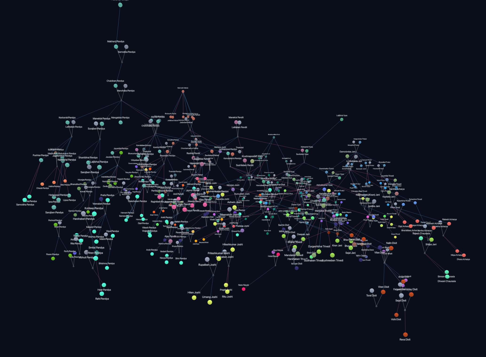

# Raktavruksha · रक्तवृक्ष

**Your family's whole story, as one living constellation.**



Every family's history lives in fragments, a grandmother's stories, a wedding album,
an uncle who remembers who married whom. **Raktavruksha** (Sanskrit for *the blood
tree*) gathers those fragments into a single explorable world: people glow as orbs
colored by their birth family, marriages arc between clans like golden bridges, and
generations stack upward so you can watch eight generations of ancestors rise above
you like a night sky.

## What it feels like

- **Wander the constellation.** Click anyone and the camera flies to them; their
  relatives stay lit while the rest of the world dims. Spin it, dive into a family,
  or step back and see every clan at once.
- **Ask "how exactly are we related?"** Pick any two people and the shortest path
  between them lights up, named not just in English ("8× great-grandfather",
  "half-sister", "mother-in-law") but with the proper Sanskrit and Gujarati terms:
  *mama*, *foi*, *dada* vs *nana*, distinctions English never had words for.
- **Read one family at a glance.** The 2D view lays each family out as a clean
  genealogical tree, eldest to youngest. Click a daughter-in-law and you follow her
  home to her own family's tree.
- **Share a branch.** Every family tree has a small **Share** button, it copies a
  link that opens exactly that family for whoever receives it.
- **Grow it together.** With the edit key, add people right on the graph; relatives
  can send you their copy and it merges in without ever deleting anything.
- **Own it completely.** No accounts, no server, no tracking. The entire family is
  one JSON file that you keep, version, and publish yourself.

## Showcase

Three trees, same app, see how it holds up on very different families:

- **[My family](https://dhawal-pandya.github.io/RaktaVruksha/)** (default). the
  real Pandya lineage this was built for.
- **[The Mahabharat: the Kuru dynasty](https://dhawal-pandya.github.io/RaktaVruksha/?data=mahabharat)**,
  the epic's cast as one graph, 260+ people across fifteen intertwined lineages,
  running from Chandra Deva down through Yayati, where the Kuru and Yadava lines
  fork, to the war and beyond. It stresses everything the schema can express:
  all hundred Kauravas, Draupadi's polyandry and Krishna's eight queens, Karna's
  and Kunti's adoptions, niyoga births, deep ancestral lineage, and even the
  devas, Surya, Indra, Vayu, the Ashvins, hovering in gold as the Pandavas'
  true fathers, present but bound to no generation. Best seen in the default 3D
  view; ask the Relation finder how Krishna and Arjuna, or Karna and
  Yudhishthira, are related.
- **[The Ramayan, the Raghu dynasty](https://dhawal-pandya.github.io/RaktaVruksha/?data=ramayan)**,
  several distinct trees at once: Rama's solar Ikshvaku line, Janaka's Videha
  line (with Sita as an adopted, earth-born daughter), Ravana's Rakshasa house of
  Lanka, and the Vanaras of Kishkindha, with the devas Vayu, Indra and Surya as
  their divine sires, connected where the epics connect them (four brothers wed
  four princesses) and disconnected where they don't (ask how Rama and Ravana are
  related, they aren't).

## Run it

```bash
cd app
npm install
npm run dev        # → http://localhost:5173
```

## Under the hood

For the data format, editing workflow, deployment, and a full tour of the code,
see the [docs](docs/), start with the
[developer guide](docs/DEVELOPER_GUIDE.md).

---

made with ❤ by [Dhawal Pandya](https://dhawal-pandya.github.io/)
